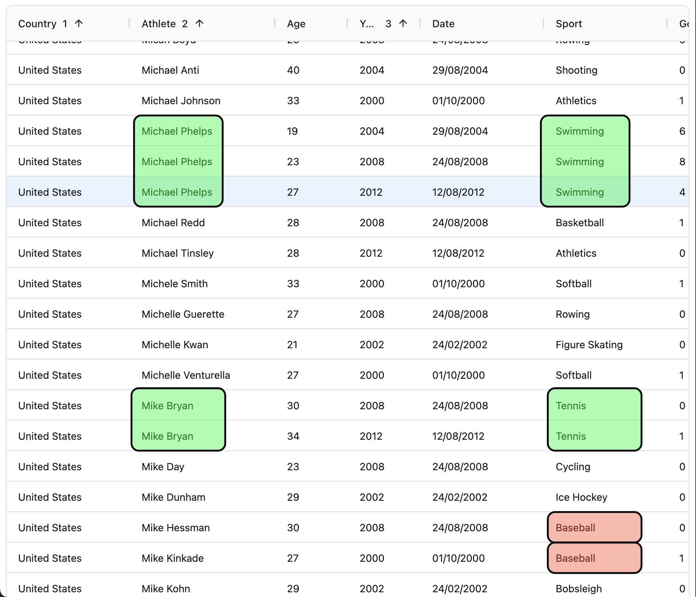
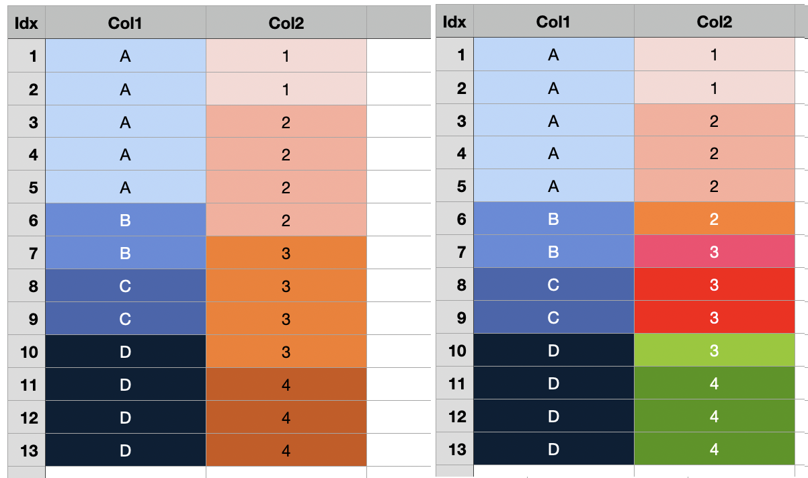

# aggrid-rowspan

## Installation

> pnpm install

## OriginalRowSpanExample

- Reference: https://www.ag-grid.com/react-data-grid/row-spanning/#row-spanning-example

- The "rowSpan" callback function usage is very restricted.

- In real cases, developer just want to "automatically" make row spanned cells if the adjacent cell data are same.

- I've reserved the word "dynamically". Because, dynamic means, user can toggle any selected cells to be spanned or not spanned,
  as well as the cell merge feature of MS Excel. This is much more complicated use cases.

- In this repo, I'm only focusing to the "automatic" row span.

## AutomaticRowSpanExample

### 1. Goal

- Grid cells should be automatically row spanned, without giving explictly define rowSpan callback function (like Original Example).
- Application developer's interest is focused on "What the rowSpanGroup rule is", not "How many rows to be spanned"

  - AgGrid's colDef.rowSpan callback function means "How many rows spanned at specific row".
  - Ofcourse, This is interst of the AgGrid. Because, row spanning count is important to the grid renderer.
  - But, In real cases, adjacent cells of same data becomes candidate of row spanned group. So the row span count can be inferred from rowData.
  - However, there exist some cases where adjacent cells of same data should be remained as seperated cells.
  - This is why, developer should pass the callback function which saying "Hey AgGrid, I want to make rowSpanGroup of these cells. You can count rowSpan number from the rowData which I gave you. I just inform you what the row spanned group rule is."

  \*Fig01. User might want to merge green cells, not red cells.

### 2. Modeling RowSpanGroup

- A RowSpanGroup is single level tree structure, consisted of "Head cell" and "Leaf cells".
- Each RowSpanGroup should have unique id of its row span group.
- "Head cell" have two responsiblity :
  - returning <b>row spanning count</b> from the AgGridColDef.rowSpan callback function
  - return <b>TRUE</b> to the row spanning cell class callback (in original example, ".cell-span") at the AgGridColDef.cellClassRules
- "Head cell" have...
  - rowNodeId list of leaf nodes of belonging row span group.
- "Leaf cell" have two responsibility :
  - returning <b>1</b> from the AgGridColDef.rowSpan callback function
  - return <b>FALSE</b> to the row spanning cell class callback (in original example, ".cell-span") at the AgGridColDef.cellClassRules
- "Leaf cell" have...
  - rowNodeId of the head node of belonging row span group.

### 3. Key ingredients

- ColDef.getRowSpanGroupId : return the unique id of its row span group. In same row span group, their rowSpanId should be same.

  - rowSpanId can be composed of multiple field value. Which means, row span group of later column can be diversed by earlier column row span group. In other words, rowSpanGroup can have hierarchy order of columns.

  \*Fig02. Visual presentation of row span group.  Left : adjacent same data is considered as a row span group.   Right : Row span group of Col2 is affected by earlier column (Col1).

- useRowSpannedRowData : input is original row data. output is augmented row data of rowSpan specific meta field attached.

- getColDef_RowSpan : Create ColDef object with rowSpan and cellClassRules are automatically assigned. Developer requires to pass getRowSpanGroupId
