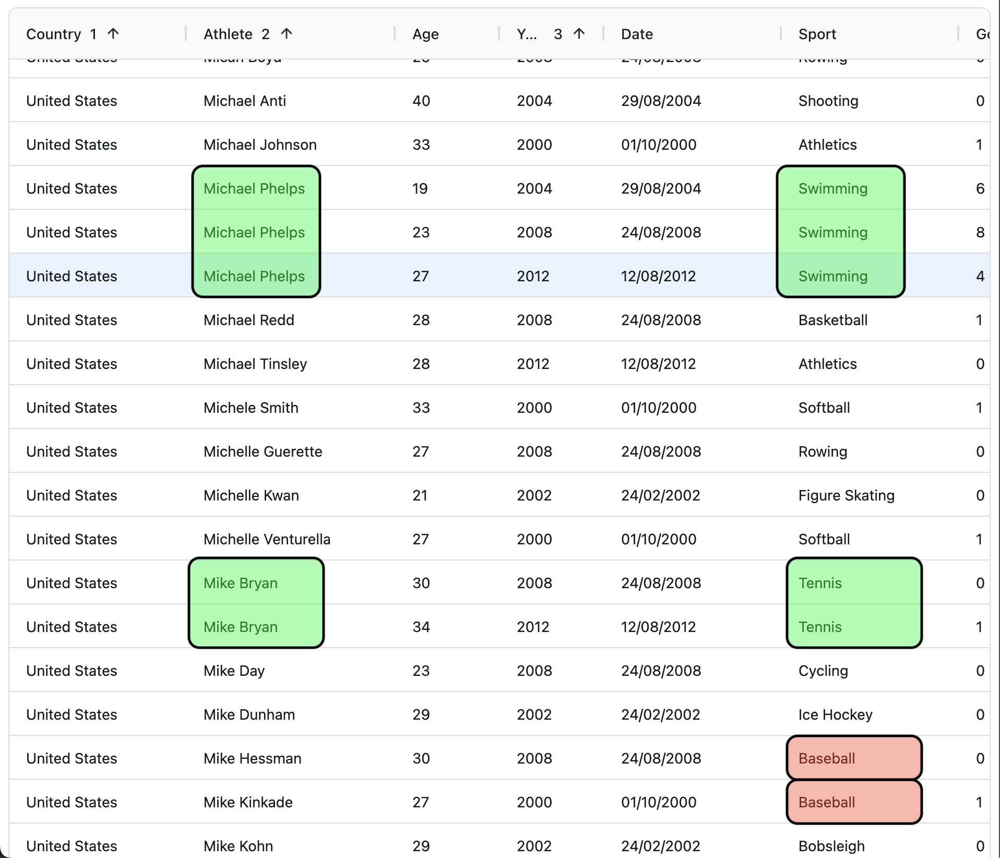
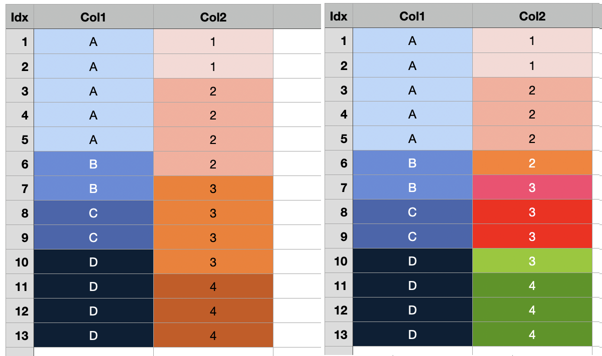

# AutomaticRowSpanExample

## 1. Goal

- Grid cells should be automatically row spanned, without giving explictly define rowSpan callback function (like Original Example).
- Developer should and only declare "What the rowSpanGroup is"

  - AgGrid's colDef.rowSpan callback function means "How many rows spanned at some row".
  - This is interst of the grid renderer (AgGrid), not developer.
  - In real cases, adjacent cells of same data becomes candidate of row spanned group.
  - But there exist cases when adjacent cells of same data should be remained as seperated cells.
  - This is why, developer should pass the callback function which saying "Hey AgGrid, I want to make rowSpannedGroup of these cells. RowSpan counting is at your own. I just inform you what the row spanned group is."

  \*Fig01. User might want to merge green cells, not red cells.

## 2. Modeling RowSpanGroup

- A RowSpanGroup is single level tree structure, consited of "Head cell" and "Leaf cells".
- Each RowSpanGroup should have unique id of its row span group.
- "Head cell" have two responsiblity :
  - returning <b>row spanning count</b> to the AgGridColDef.rowSpan callback function
  - return <b>TRUE</b> for the row spanning cell class rule callback (in original example, ".cell-span") to the AgGridColDef.cellClassRules
- "Head cell" have rowNodeId list of same group leaf nodes.
- "Leaf cell" have two responsibility :
  - returning <b>1</b> to the AgGridColDef.rowSpan callback function
  - return <b>FALSE</b> for the row spanning cell class rule callback (in original example, ".cell-span") to the AgGridColDef.cellClassRules
- "Leaf cell" have rowNodeId to the head node of its row span group.
- These rowSpanGroup information should be coexisted by each row data. So, we should make an metadata field.

## 3. Key ingredients

- ColDef.getRowSpan(Group)Id : return the unique id of its row span group. In same row span group, their rowSpanId should be same.

  - rowSpanId can be composed of multiple field value. Which means, row span group of later colume could be diversed by earlier column value. In other words, rowSpanGroup can have hierarchy order by column.

  \*Fig02. Visual presentation of row span group.  Left : adjacent same data is considered as a row span group.   Right : Row span group of Col2 is affected by earlier column (Col1).

  - useRowSpannedRowData : input is original row data. output is augmented row data which is rowSpan meta field attached.
